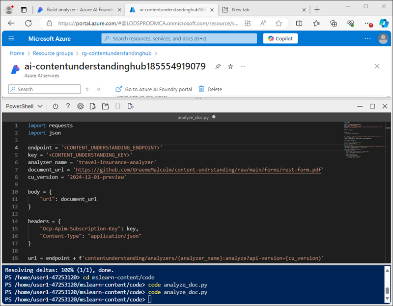

---
lab:
  title: Análisis de contenido con Servicio de compresión de contenido de IA de Azure
  module: Multimodal analysis with Content Understanding
---

# Análisis de contenido con Servicio de compresión de contenido de IA de Azure

En este ejercicio, usarás el portal de la Fundición de IA de Azure para crear un proyecto de comprensión de contenidos que pueda extraer información de formularios de pólizas de seguro de viaje. A continuación, probarás el analizador de contenido en el portal de Azure AI Foundry y lo consumirás a través de la interfaz REST de comprensión de contenidos.

Este ejercicio dura aproximadamente **30** minutos.

## Creación de un proyecto de comprensión de contenidos

Empecemos con el uso del portal de Azure AI Foundry para crear un proyecto de comprensión de contenidos.

1. En un explorador web, abre el [portal de Azure AI Foundry](https://ai.azure.com) en `https://ai.azure.com` e inicia sesión con tus credenciales de Azure.

    La página principal del portal de Azure AI Foundry tiene un aspecto similar al de la siguiente imagen:

    

1. En la sección **Buscar rápido** de la página principal, hacia la parte inferior, selecciona **Comprensión de contenidos**.
1. En la página **Comprensión de contenidos**, selecciona el botón **Crear nuevo proyecto de comprensión de contenidos**.
1. En el paso **Información general del proyecto**, establece las siguientes propiedades para el proyecto y, a continuación, selecciona **Siguiente**:
    - **Nombre del proyecto**: `travel-insurance`
    - **Descripción**: `Insurance policy data extraction`
    - **Centro**: crea un nuevo centro
1. En el paso **Crear un centro**, establece las siguientes propiedades y, a continuación, selecciona **Siguiente**:
    - **Recurso de Centro de Azure AI**: `content-understanding-hub`
    - **Suscripción de Azure**: *selecciona tu suscripción de Azure*
    - **Grupo de recursos**: *crea un nuevo grupo de recursos con un nombre apropiado*
    - **Ubicación**: *Seleccione cualquier ubicación disponible*
    - **Servicios de Azure AI**: *crea un nuevo recurso de servicios de Azure AI con un nombre adecuado*
1. En el paso **Configuración de almacenamiento**, especifica una nueva cuenta de almacenamiento de Centro de IA y selecciona **Siguiente**.
1. En la página **Revisar**, selecciona **Crear proyecto**. A continuación, espera a que se cree el proyecto y sus recursos relacionados.

    Cuando el proyecto esté listo, se abrirá en la página **Definir esquema**.

    

## Revisión de recursos de Azure

Al crear el Centro de IA y el proyecto, se crearon varios recursos en la suscripción a Azure para respaldar el proyecto.

1. En un explorador web, abre [Azure Portal](https://portal.azure.com) en `https://portal.azure.com` e inicia sesión con tus credenciales de Azure.
1. Navega al grupo de recursos que creaste para tu centro y observa los recursos de Azure que se han creado.

    

## Definición de un esquema personalizado

Vas a crear un analizador que pueda extraer información de formularios de seguros de viaje. Empezarás por la definición un esquema basado en un formulario de ejemplo.

1. Descarga el formulario de ejemplo [train-form.pdf](https://github.com/microsoftlearning/mslearn-ai-document-intelligence/raw/main/Labfiles/05-content-understanding/forms/train-form.pdf) desde `https://github.com/microsoftlearning/mslearn-ai-document-intelligence/raw/main/Labfiles/05-content-understanding/forms/train-form.pdf` y guárdalo en una carpeta local.
1. Vuelve a la pestaña del explorador que contiene el proyecto de comprensión de contenidos y, en la página **Definir esquema**, carga el archivo **train-form.pdf** que acabas de descargar.
1. Selecciona la plantilla **Análisis de documento** y, a continuación, selecciona **Crear**.

    El editor de esquemas proporciona una manera de definir los campos de datos que se van a extraer del formulario, que se muestra a la derecha. El formulario se parece a esto:

    

    Los campos de datos del formulario constan de:
    
    - Una colección de detalles personales relacionados con el titular de la póliza.
    - Una colección de detalles relacionados con el viaje para el que se necesita un seguro.
    - Una firma y fecha

    Empezaremos por agregar un campo que represente los detalles personales como una tabla, en la que definiremos subcampos para los detalles individuales.

1. Selecciona **+Agregar nuevo campo** para crear un campo nuevo con los valores siguientes:
    - **Nombre de campo**: `PersonalDetails`
    - **Descripción del campo**: `Policyholder information`
    - **Tipo de valor**: Tabla
1. Selecciona **Guardar cambios** (&#10004;) y observa que se crea automáticamente un nuevo subcampo.
1. Configura el nuevo subcampo con los siguientes valores:
    - **Nombre de campo**: `PolicyholderName`
    - **Descripción del campo**: `Policyholder name`
    - **Tipo de valor**: cadena
    - **Método**: extraer
1. Usa el botón **+ Agregar nuevo subcampo** para agregar los siguientes subcampos adicionales:

    | Nombre del campo | Descripción del campo | Tipo de valor | Método |
    |--|--|--|--|
    | `StreetAddress` | `Policyholder address` | Cadena | Extracción |
    | `City` | `Policyholder city` | Cadena | Extracción |
    | `PostalCode` | `Policyholder post code` | Cadena | Extracción |
    | `CountryRegion` | `Policyholder country or region` | Cadena | Extracción |
    | `DateOfBirth` | `Policyholder birth date` | Fecha | Extracción |

1. Cuando hayas agregado todos los subcampos de detalles personales, usa el botón **Atrás** para volver al nivel superior del esquema.
1. Agrega un nuevo campo de *tabla* denominado **`TripDetails`** para representar los detalles del viaje asegurado. A continuación, agrégale los subcampos siguientes:

    | Nombre del campo | Descripción del campo | Tipo de valor | Método |
    |--|--|--|--|
    | `DestinationCity` | `Trip city` | Cadena | Extracción |
    | `DestinationCountry` | `Trip country or region` | Cadena | Extracción |
    | `DepartureDate` | `Date of departure` | Fecha | Extracción |
    | `ReturnDate` | `Date of return` | Fecha | Extracción |

1. Vuelve al nivel superior del esquema y agrega los dos campos individuales siguientes:

    | Nombre del campo | Descripción del campo | Tipo de valor | Método |
    |--|--|--|--|
    | `Signature` | `Policyholder signature` | Cadena | Extracción |
    | `Date` | `Date of signature` | Fecha | Extracción |

1. Comprueba que el esquema completado tiene este aspecto y guárdalo.

    

1. En la página **Analizador de pruebas**, si el análisis no se inicia automáticamente, selecciona **Ejecutar análisis**. A continuación, espera a que el análisis se complete y revisa los valores de texto del formulario que se identifican como coincidentes con los campos del esquema.

    

    El servicio de comprensión de contenidos debe haber identificado correctamente el texto que corresponde a los campos del esquema. Si no lo hubieras hecho, podrías usar la página **Etiquetado de datos** para cargar otro formulario de ejemplo e identificar explícitamente el texto correcto para cada campo.

## Compilación y prueba de un analizador

Ahora que has entrenado un modelo para extraer campos de formularios de seguros, puedes compilar un analizador para usarlo con formularios similares.

1. En el panel de navegación de la izquierda, selecciona la página **Compilar analizador**.
1. Selecciona **+ Compilar analizador** y crea un nuevo analizador con las siguientes propiedades (con el tipo exactamente como se muestra aquí):
    - **Nombre**: `travel-insurance-analyzer`
    - **Descripción**: `Insurance form analyzer`
1. Espera a que el nuevo analizador esté listo (usa el botón **Actualizar** para comprobar).
1. Descarga [test-form.pdf](https://github.com/microsoftlearning/mslearn-ai-document-intelligence/raw/main/Labfiles/05-content-understanding/forms/test-form.pdf) desde `https://github.com/microsoftlearning/mslearn-ai-document-intelligence/raw/main/Labfiles/05-content-understanding/forms/test-form.pdf` y guárdalo en una carpeta local.
1. Vuelve a la página **Compilar analizador** y selecciona el vínculo **travel-insurance-analyzer**. Se mostrarán los campos definidos en el esquema del analizador.
1. En la página **travel-insurance-analyzer**, selecciona **Probar**.
1. Usa el botón **+ Cargar archivos de prueba** para cargar **test-form.pdf** y ejecuta el análisis para extraer datos de campo del formulario de prueba.

    

1. Visualiza la pestaña **Resultado** para ver los resultados con formato JSON devueltos por el analizador. En la siguiente tarea, usarás la API de REST de comprensión de contenidos para enviar un formulario a tu analizador y devolver los resultados en este formato.
1. Cierra la página **travel-insurance-analyzer**.

## Uso de la API de REST de comprensión de contenidos

Ahora que has creado un analizador, puedes consumirlo desde una aplicación cliente a través de la API de REST de comprensión de contenido.

1. Cambia a la pestaña del explorador que contiene Azure Portal (o abre `https://portal.azure.com` en una pestaña nueva si la has cerrado).
1. En el grupo de recursos de tu centro de comprensión de contenidos, abre el recurso **Servicios de Azure AI**.
1. En la página **Información general**, en la sección **Claves y punto de conexión**, visualiza la pestaña **Comprensión de contenidos**.

    

    Necesitarás el punto de conexión de comprensión de contenidos y una de las claves para conectarte al analizador desde una aplicación cliente.

1. Usa el botón **[\>_]** situado a la derecha de la barra de búsqueda en la parte superior de la página para crear una nueva instancia de Cloud Shell en Azure Portal, para lo que deberás seleccionar un entorno de ***PowerShell***. Cloud Shell proporciona una interfaz de línea de comandos en un panel situado en la parte inferior de Azure Portal, como se muestra a continuación:

    

    > **Nota**: si has creado anteriormente una instancia de Cloud Shell que usa un entorno de *Bash*, cámbiala a ***PowerShell***.

1. Ten en cuenta que puedes cambiar el tamaño de la instancia de Cloud Shell. Para ello, arrastra la barra de separación de la parte superior del panel o utiliza los iconos **&#8212;**, **&#10530;** y **X** de la parte superior derecha del panel para minimizar, maximizar y cerrar el panel. Para obtener más información sobre el uso de Azure Cloud Shell, consulta la [documentación de Azure Cloud Shell](https://docs.microsoft.com/azure/cloud-shell/overview).
1. En la barra de herramientas de Cloud Shell, en el menú **Configuración**, selecciona **Ir a la versión clásica** (esto es necesario para usar el editor de código).

1. En el panel de PowerShell, escribe los siguientes comandos para clonar el repo de GitHub para este ejercicio:

    ```
    rm -r mslearn-ai-doc -f
    git clone https://github.com/microsoftlearning/mslearn-ai-document-intelligence mslearn-ai-doc
    ```

1. Una vez clonado el repo, ve a la carpeta **mslearn-ai-doc/Labfiles/05-content-understanding/code**:

    ```
    cd mslearn-ai-doc/Labfiles/05-content-understanding/code
    ```

1. Escribe el siguiente comando para editar el archivo de código de Python **analyze_doc.py** que se ha proporcionado:

    ```
    code analyze_doc.py
    ```
    El archivo de código de Python se abre en un editor de código:

    

1. En el archivo de código, reemplaza el marcador de posición **\<CONTENT_UNDERSTANDING_ENDPOINT\>** por el punto de conexión de comprensión de contenidos y el marcador de posición **\<CONTENT_UNDERSTANDING_KEY\>** por una de las claves para tu recurso de Servicios de Azure AI.

    > **Sugerencia**: tendrás que cambiar el tamaño o minimizar la ventana de Cloud Shell para copiar el punto de conexión y la clave de la página de recursos de Servicios de Azure AI en Azure Portal; ten cuidado de no *cerrar* Cloud Shell (o tendrás que repetir los pasos anteriores).

1. Después de reemplazar los marcadores de posición, usa el comando **CTRL+S** para guardar los cambios y, a continuación, revisa el código completado, que:
    - Envía una solicitud HTTP POST al punto de conexión de comprensión de contenidos, lo que indica a **travel-insurance-analyzer** que analice un formulario en función de su dirección URL.
    - Comprueba la respuesta de la operación POST para recuperar un Id. para la operación de análisis.
    - Envía repetidamente una solicitud HTTP GET al servicio de comprensión de contenidos hasta que la operación ya no se esté ejecutando.
    - Si la operación se ha realizado correctamente, muestra la respuesta JSON.
1. Usa el comando **CTRL+Q** para cerrar el editor de código mientras mantienes abierta la línea de comandos de Cloud Shell.
1. En el panel de línea de comandos de Cloud Shell, escribe el siguiente comando para instalar la biblioteca de **solicitudes** de Python (que se usa en el código):

    ```
    pip install requests
    ```

1. Una vez instalada la biblioteca, en el panel de línea de comandos de Cloud Shell, escribe el siguiente comando para ejecutar el código de Python:

    ```
    python analyze_doc.py
    ```

1. Revisa la salida del programa, que incluye los resultados JSON del análisis del documento.

    > **Sugerencia**: es posible que el búfer de pantalla de la consola de Cloud Shell no sea lo suficientemente grande como para mostrar toda la salida. Si quieres revisar toda la salida, ejecuta el programa mediante el comando `python analyze_doc.py > output.txt`. A continuación, cuando finalice el programa, usa el comando `code output.txt` para abrir la salida en un editor de código.

## Limpieza

Si has terminado de trabajar con el servicio de comprensión de contenidos, deberías eliminar los recursos que has creado en este ejercicio para evitar incurrir en costes innecesarios de Azure.

1. En el portal de Azure AI Foundry, ve al proyecto **travel-insurance** y elimínalo.
1. En Azure Portal, elimina el grupo de recursos que has creado en este ejercicio.

