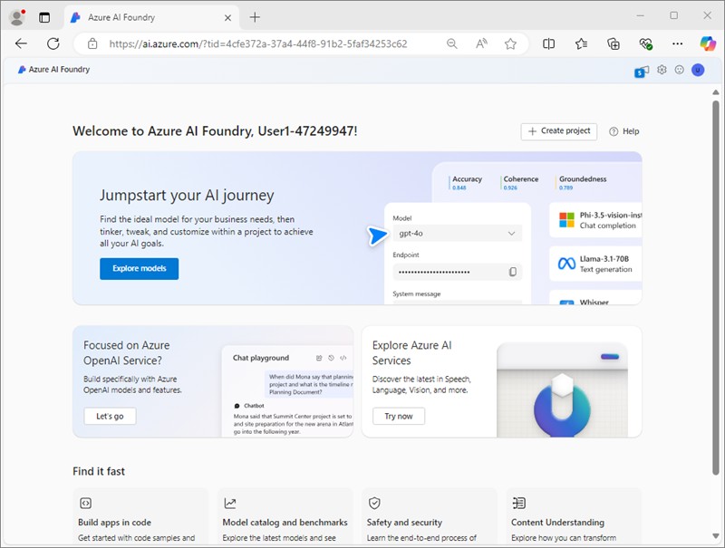

---
lab:
  title: Análisis de contenido con Servicio de compresión de contenido de IA de Azure
  module: Multimodal analysis with Content Understanding
---

# Análisis de contenido con Servicio de compresión de contenido de IA de Azure

En este ejercicio, usarás el Portal de la Fundición de IA de Azure para crear un proyecto de comprensión de contenidos que pueda extraer información de facturas. A continuación, probarás el analizador de contenido en el portal de Azure AI Foundry y lo consumirás a través de la interfaz REST de comprensión de contenidos.

Este ejercicio dura aproximadamente **30** minutos.

## Creación de un proyecto de Fundición de IA de Azure

Comencemos creando un proyecto de Fundición de IA de Azure.

1. En un explorador web, abre el [Portal de la Fundición de IA de Azure](https://ai.azure.com) en `https://ai.azure.com` e inicia sesión con tus credenciales de Azure. Cierra las sugerencias o paneles de inicio rápido que se abran la primera vez que inicias sesión y, si es necesario, usa el logotipo de **Fundición de IA de Azure** en la parte superior izquierda para navegar a la página principal, que es similar a la siguiente imagen:

    

1. En la página principal, selecciona **+Crear proyecto**.
1. En el asistente para **crear un proyecto**, escribe un nombre válido y si se te sugiere un centro existente, elige la opción para crear uno nuevo. A continuación, revisa los recursos de Azure que se crearán automáticamente para admitir el centro y el proyecto.
1. Selecciona **Personalizar** y especifica la siguiente configuración para el centro:
    - **Nombre del centro**: *un nombre válido para el centro*
    - **Suscripción**: *suscripción a Azure*
    - **Grupo de recursos**: *crea o selecciona un grupo de recursos*
    - **Ubicación**: elige una de las siguientes regiones\*
        - Oeste de EE. UU.
        - Centro de Suecia
        - Este de Australia
    - **Conectar Servicios de Azure AI o Azure OpenAI**: *crea un nuevo recurso de servicios de IA*
    - **Conexión de Búsqueda de Azure AI**: *crea de un nuevo recurso de Búsqueda de Azure AI con un nombre único*

    > \*En el momento de escribir esto, la comprensión de contenidos de Azure AI solo está disponible en estas regiones.

1. Selecciona **Siguiente** y revisa tu configuración. Luego, selecciona **Crear** y espera a que se complete el proceso.
1. Cuando se cree el proyecto, cierra las sugerencias que se muestran y revisa la página del proyecto en el Portal de la Fundición de IA de Azure, que debe tener un aspecto similar a la siguiente imagen:

    

## Crear un analizador de comprensión de contenidos

Vas a crear un analizador que pueda extraer información de facturas. Empezarás por la definición un esquema basado en una factura de ejemplo.

1. En una nueva pestaña del explorador, descarga el formulario de ejemplo [invoice-1234.pdf](https://github.com/microsoftlearning/mslearn-ai-document-intelligence/raw/main/Labfiles/05-content-understanding/forms/invoice-1234.pdf) desde `https://github.com/microsoftlearning/mslearn-ai-document-intelligence/raw/main/Labfiles/05-content-understanding/forms/invoice-1234.pdf` y guárdalo en una carpeta local.
1. Vuelve a la pestaña que contiene la página principal del proyecto de Fundición de IA de Azure, y en el panel de navegación de la izquierda, selecciona **Comprensión de contenidos**.
1. En la página **Comprensión de contenidos**, selecciona la pestaña **Analizador personalizado** en la parte superior.
1. En la página Analizador personalizado de comprensión de contenidos, selecciona **+ Crear** y crea una tarea con la siguiente configuración:
    - **Nombre de tarea**: análisis de facturas
    - **Descripción**: extracción de datos de una factura
    - **Conexión de Servicios de Azure AI**: *el recurso de Servicios de Azure AI en el centro de Fundición de IA de Azure*
    - **Cuenta de Azure Blob Storage**: *la cuenta de almacenamiento predeterminada en el centro de Fundición de IA de Azure*
1. Espera a que se cree la tarea.

    > **Sugerencia**: si se produce un error al acceder al almacenamiento, espera un minuto e inténtalo de nuevo.

1. En la página **Definir esquema**, carga el archivo **invoice-1234.pdf** que acabas de descargar.
1. Selecciona la plantilla **Invoice analysis** y, a continuación, selecciona **Crear**.

    La plantilla *Invoice analysis* incluye campos comunes que se encuentran en las facturas. Puedes usar el editor de esquemas para eliminar cualquiera de los campos sugeridos que no necesites y agregar los campos personalizados que sí necesitas.

1. En la lista de campos sugeridos, selecciona **BillingAddress**. Este campo no es necesario para el formato de factura que has cargado, así que usa el icono **Eliminar campo** (**&#128465;**) que aparece para eliminarlo.
1. Ahora elimina los siguientes campos sugeridos, que no son necesarios:
    - BillingAddressRecipient
    - CustomerAddressRecipient
    - CustomerId
    - CustomerTaxId
    - DueDate
    - InvoiceTotal
    - PaymentTerm
    - PreviousUnpaidBalance
    - PurchaseOrder
    - RemittanceAddress
    - RemittanceAddressRecipient
    - ServiceAddress
    - ServiceAddressRecipient
    - ShippingAddress
    - ShippingAddressRecipient
    - TotalDiscount
    - VendorAddressRecipient
    - VendorTaxId
    - TaxDetails
1. Usa el botón **+ Agregar nuevo campo** para agregar los siguientes campos:

    | Nombre del campo | Descripción del campo | Tipo de valor | Método |
    |--|--|--|--|
    | `VendorPhone` | `Vendor telephone number` | Cadena | Extracto |
    | `ShippingFee` | `Fee for shipping` | Número | Extracto |

1. Comprueba que el esquema completado tiene este aspecto y selecciona **Guardar**.
    

1. En la página **Analizador de pruebas**, si el análisis no se inicia automáticamente, selecciona **Ejecutar análisis**. A continuación, espera a que el análisis se complete y revisa los valores de texto de la factura que se identifican como coincidentes con los campos del esquema.
1. Revisa los resultados del análisis, que deben ser similares a esto:

    

1. Visualiza los detalles de los campos identificados en el panel **Campos** y, después, visualiza la pestaña **Resultado** para ver la representación JSON.

## Compilación y prueba de un analizador

Ahora que has entrenado un modelo para extraer campos de facturas, puedes crear un analizador para usarlo con formularios similares.

1. Selecciona página **Compilar analizador** y, después, selecciona **+ Compilar analizador** y crea un nuevo analizador con las siguientes propiedades (especificadas exactamente como se muestra aquí):
    - **Nombre**: `contoso-invoice-analyzer`
    - **Descripción**: `Contoso invoice analyzer`
1. Espera a que el nuevo analizador esté listo (usa el botón **Actualizar** para comprobar).
1. Descarga [invoice-1235.pdf](https://github.com/microsoftlearning/mslearn-ai-document-intelligence/raw/main/Labfiles/05-content-understanding/forms/invoice-1235.pdf) desde `https://github.com/microsoftlearning/mslearn-ai-document-intelligence/raw/main/Labfiles/05-content-understanding/forms/invoice-1235.pdf` y guárdalo en una carpeta local.
1. Vuelve a la página **Compilar analizador** y selecciona el vínculo **contoso-invoice-analyzer**. Se mostrarán los campos definidos en el esquema del analizador.
1. En la página **contoso-invoice-analyzer**, selecciona la pestaña **Probar**.
1. Usa el botón **+ Cargar archivos de prueba** para cargar **invoice-1235.pdf** y ejecuta el análisis para extraer datos de campo del formulario de prueba.
1. Revisa los resultados de la prueba y comprueba que el analizador extrajo los campos correctos de la factura de prueba.
1. Cierra la página **contoso-invoice-analyzer***.

## Uso de la API de REST de comprensión de contenidos

Ahora que has creado un analizador, puedes consumirlo desde una aplicación cliente a través de la API de REST de comprensión de contenido.

1. En el área **Detalles del proyecto**, anota la **Cadena de conexión del proyecto**. Usarás esta cadena de conexión para conectarte al proyecto en una aplicación cliente.
1. Abre una nueva pestaña del explorador (mantén el Portal de la Fundición de IA de Azure abierto en la pestaña existente). En la nueva pestaña, explora [Azure Portal](https://portal.azure.com) en `https://portal.azure.com` e inicia sesión con tus credenciales de Azure, si se te solicita.

    Cierra las notificaciones de bienvenida para ver la página principal de Azure Portal.

1. Usa el botón **[\>_]** situado a la derecha de la barra de búsqueda en la parte superior de la página para crear una nueva instancia de Cloud Shell en Azure Portal, para lo que deberás seleccionar un entorno de ***PowerShell*** sin almacenamiento en tu suscripción.

    Cloud Shell proporciona una interfaz de la línea de comandos en un panel situado en la parte inferior de Azure Portal. Puedes cambiar el tamaño o maximizar este panel para facilitar el trabajo.

    > **Nota**: si has creado anteriormente una instancia de Cloud Shell que usa un entorno de *Bash*, cámbiala a ***PowerShell***.

1. En la barra de herramientas de Cloud Shell, en el menú **Configuración**, selecciona **Ir a la versión clásica** (esto es necesario para usar el editor de código).

    **<font color="red">Asegúrate de que has cambiado a la versión clásica de Cloud Shell antes de continuar.</font>**

1. En el panel de Cloud Shell, escribe los siguientes comandos para clonar el repositorio de GitHub que contiene los archivos de código de este ejercicio (escribe el comando o cópialo en el Portapapeles y haz clic con el botón derecho en la línea de comandos y pega como texto sin formato):

    ```
   rm -r mslearn-ai-foundry -f
   git clone https://github.com/microsoftlearning/mslearn-ai-document-intelligence mslearn-ai-doc
    ```

    > **Sugerencia**: al pegar comandos en CloudShell, la salida puede ocupar una gran cantidad del búfer de pantalla. Puedes despejar la pantalla al escribir el comando `cls` para que te resulte más fácil centrarte en cada tarea.

1. Una vez clonado el repo, ve a la carpeta que contiene los archivos de código de la aplicación:

    ```
   cd mslearn-ai-doc/Labfiles/05-content-understanding/code
   ls -a -l
    ```

1. En el panel de la línea de comandos de Cloud Shell, escribe el siguiente comando para instalar las bibliotecas que vas a usar:

    ```
   python -m venv labenv
   ./labenv/bin/Activate.ps1
   pip install dotenv azure-identity azure-ai-projects
    ```

1. Escribe el siguiente comando para editar el archivo de configuración que se ha proporcionado:

    ```
   code .env
    ```

    El archivo se abre en un editor de código.

1. En el archivo de código, reemplaza el marcador de posición **YOUR_PROJECT_CONNECTION_STRING** por la cadena de conexión del proyecto (copiado de la página **Información general del proyecto** en el Portal de la Fundición de IA de Azure) y asegúrate de que **ANALIZADOR** esté establecido en el nombre que asignaste al analizador (que debe ser *contoso-invoice-analyzer*).
1. Después de reemplazar los marcadores de posición, usa el comando **CTRL+S** para guardar los cambios y, después, usa el comando **CTRL+Q** para cerrar el editor de código mientras mantienes abierta la línea de comandos de Cloud Shell.

1. En la línea de comandos de Cloud Shell, escribe el siguiente comando para editar el archivo de código de Python **analyze_invoice.py** que se ha proporcionado:

    ```
    code analyze_invoice.py
    ```
    El archivo de código de Python se abre en un editor de código:

1. Revisa el código, que:
    - Identifica el archivo de factura que se va a analizar, con un valor predeterminado de **invoice-1236.pdf**.
    - Recupera el punto de conexión y la clave del recurso de Servicios de Azure AI del proyecto.
    - Envía una solicitud HTTP POST al punto de conexión de comprensión de contenidos para indicarle que analice la imagen.
    - Comprueba la respuesta de la operación POST para recuperar un Id. para la operación de análisis.
    - Envía repetidamente una solicitud HTTP GET al servicio de comprensión de contenidos hasta que la operación ya no se esté ejecutando.
    - Si la operación se ha realizado correctamente, analiza la respuesta JSON y muestra los valores recuperados
1. Usa el comando **CTRL+Q** para cerrar el editor de código mientras mantienes abierta la línea de comandos de Cloud Shell.
1. En el panel de línea de comandos de Cloud Shell, escribe el siguiente comando para ejecutar el código Python:

    ```
    python analyze_invoice.py invoice-1236.pdf
    ```

1. Revisa salida del programa.
1. Usa el siguiente comando para ejecutar el programa con una factura diferente:

    ```
    python analyze_invoice.py invoice-1235.pdf
    ```

    > **Sugerencia**: hay tres archivos de factura en la carpeta de código que puedes usar (invoice-1234.pdf, invoice-1235.pdf e invoice-1236.pdf) 

## Limpieza

Si has terminado de trabajar con el servicio de comprensión de contenidos, deberías eliminar los recursos que has creado en este ejercicio para evitar incurrir en costes innecesarios de Azure.

1. En el portal de Azure AI Foundry, ve al proyecto **travel-insurance** y elimínalo.
1. En Azure Portal, elimina el grupo de recursos que has creado en este ejercicio.

